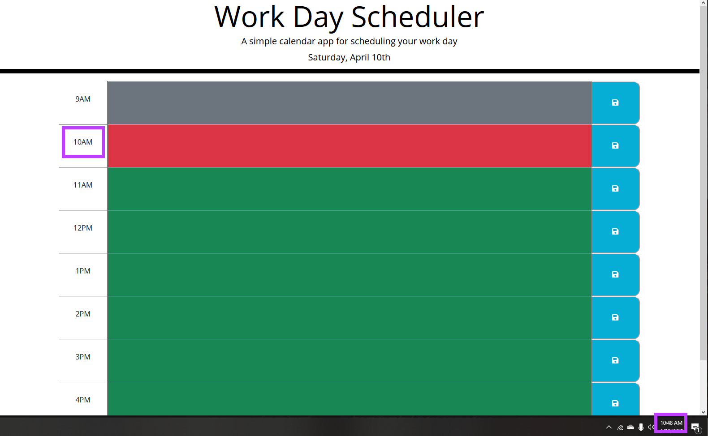

# TS-05-Event-Planner

This project is an event planner that allows the user to record inputted events planned throughout a 9-to-5 standard schedule.

The code first uses moment.js and jquery to find the current date, and print it to the top of the screen. From there, it compares the current time to the "time value" of each block, and colors the block accordingly: grey (secondary) for past, red (danger) for present, and green (success) for future. The remainder of the code assigns a save button to each code block that allows the user to save their inputs to each block.

Live Project: https://thomassiopes.github.io/TS-05-Event-Planner/

